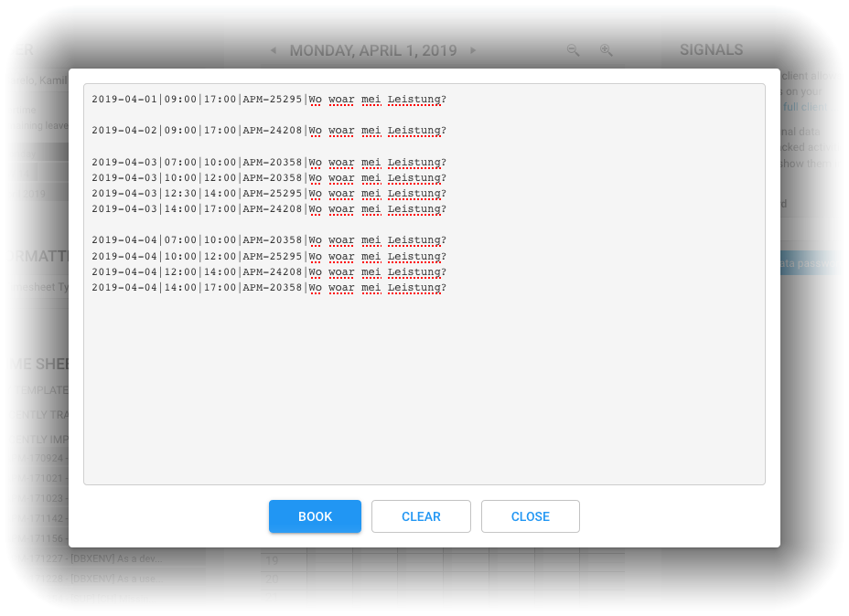
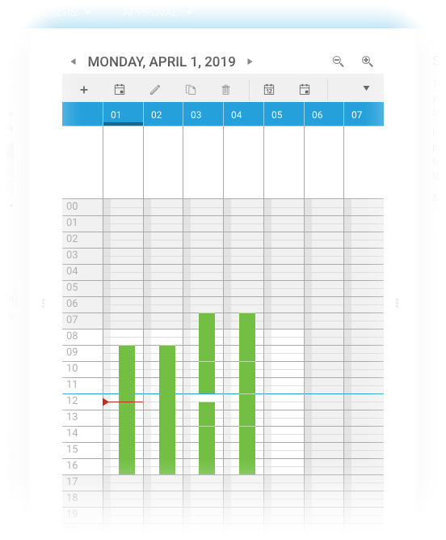

# Tracking working time at Dynatrace with my Excel spreadsheet

Since 2008 my Excel spreadsheet helps hundreds of Dynatrace developers to minimize the time they waste on the tedious and bureaucratic task of tracking and booking their working time.

After the transition to Timecockpit on 2019-04-01 you'll need:

- my [**Excel spreadsheet**](./spreadsheet/spreadsheet_template_de_v17.xlsx) v17+ and
- my **bookmarklet**

...to track your working times easily and book them in Timecockpit semi-automatically.

## How to

1. Create a bookmark in your browser with the following code as location/url (this is the actual bookmarklet):

```
javascript:void%20function(){var%20e=document.createElement(%22script%22);e.src=%22https://christian-fischer.github.io/com.dynatrace.timetracking.bookmarklet.js%3Fq=%22+(new%20Date).getTime(),e.type=%22text/javascript%22,e.onreadystatechange=e.onload=function(){var%20t=e.readyState;t%26%26%22loaded%22!==t%26%26%22complete%22!==t%26%26alert(%22could%20not%20load%20bookmarklet%22)},document.head.appendChild(e)}();
```

2. Download the latest spreadsheet and migrate your data from the old one.\
   Safest way to do this is:
   - copy the cells in the old spreadsheet,
   - paste and cut in TextEdit / Notepad / Notepad++ / any plain text editor,
   - paste the text in the latest spreadsheet.

&#160;

3. Copy the Timecockpit-prepared strings from the latest spreadsheet:


4. Click the bookmarklet in your browser and it will:
   - redirect to Timecockpit if not open yet (click the bookmarklet again afterwards),
   - open its own window within Timecockpit.

&#160;

5. Paste the copied strings from the spreadsheet into the bookmarklet's window:



6. Click BOOK and lean back. After the bookmarklet is finished you should see the result in Timecockpit:



## Compile code with generated source maps

Run the following commands after cloning the repository (requires Node.js >= 10 to be installed on your system):

```
npm install
npm run build
```

The generated files can be found in `/bookmarklet/dist`.
